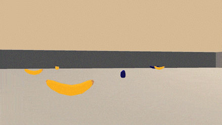
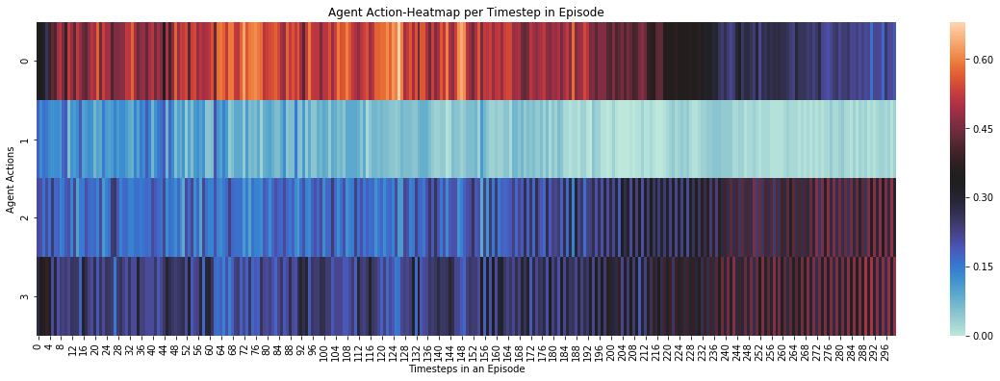

<h1>Navigation RL Agent</h1>

In this Reinforcement Learning <em>(RL)</em> project, State of the Art RL algorithms like <em>Deep-Q-Networks & <b>Prioritized</b> Deep-Q-Network architectures</em> are explored to build an AI Agent to successfully navigate through a custom environment while avoiding obstacles. The RL task explored in this project is <b>Episodic</b> in nature.

  
   <em>Agent interaction with Environment in Project</em>

<h4>Objective</h4>
The objective is to train an <em>Reinforcement Learning Agent</em> to autonomously traverse through an enclosed environment by choosing appropriate actions in order to maximize its reward by collecting <b>Yellow Bananas</b> while minimizing penalties incurred by gathering <b>Blue Bananas</b>. The objects / bananas are randomly spawned in the environment over all of the timesteps in an episode simulation.

<h2>RL Environment</h2>

The simulated environment contains a <b>single</b> agent which navigates in the enclosed world with the task of maximizing the number of <b>Yellow</b> bananas collected while <em>minimizing / avoiding</em> the number of <b>Blue</b> bananas gathered. The state of the Environment is also synced with the Episodic nature of the task — each Episode is defined by <b>300 timesteps</b>. At each timestep, the Agent can pick exactly one action from all the possible actions in <em>Action-Space</em>.

  
   <em>Average Freq. of Action choice (action-labels: 0,1,2,3) per action for the Agent for each timestep in an Episode</em>

<h3><em>State-Action Space</em></h3>

- The <b>State</b>-space of Agent in the defined Environment is determined by a vector of <b><em>37 (Observation Space Size) float values</em></b>. This Observation vector  carries vital information about the Envrionment & Agent at every timestep in an Episode like the agent's velocity, along with ray-based perception of objects around agent's forward direction etc.

- The <b>Action</b>-space for the Agent is defined by a vector of size <b>4</b> i.e. there are 4 possible actions for the Agent to choose from in order to interact with the Environment. The <em>4</em> possible actions are related with navigation of the Agent & are as follows - <b><em>Forwards, Backwards, Left, Right</em></b>.

<h3><em>Reward Scheme</em></h3>
The Agent is awarded <b>+1</b> point for collecting <b><em>Yellow bananas</em></b>, while colliding / gathering with a <b><em>Blue banana</em></b> incurs a penalty of <b>-1</b> point. <em>The collecting / gathering interaction mechanism of the AI Agent with environment objects is simple & by means of collision or contact between Agent & object (banana)</em>.

<h2>Project Observations & Results</h2>

In this task, the normal <b>Deep-Q-Network</b> (DQN) architecture seems to outperform a <b>DQN with Prioritiztion</b> mechanism by achieving target-number of reward points within shorter number of iterations in contrast to <em>Prioritized DQN</em>. This could be because of the a leaky bias problem injected by the Prioritization mechanism implemented in the Agent Experience Buffer.

<h3><em>Results</em></h3>

  </img>
   
  <em>Resulting Training Observation for the DQN RL Agent</em>

The RL Agent has a very progressive improvement for the first <em>300 ~ 350 Episodes</em> after which the Reward for the Agent saturates till +13 points per episode & does not appreciably increase from there.
